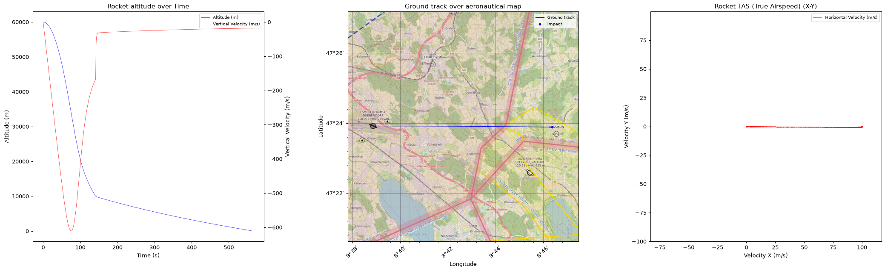

# Atmospheric Reentry Model

A Python toolkit for simulating the atmospheric reentry of a rocket stage,
with a configurable degree of physical realism — from a simple flat-Earth
model to a spherical-Earth model with ECEF dynamics, altitude-dependent
gravity and air density, Earth-rotation pseudo-forces, and interpolated
real wind fields from ERA5.

Copyright 2026 Jonas Zbinden. Licensed under the MIT License (see
`src/atmospheric_reentry/LICENSE.txt`).

This software is provided "as is", without warranty of any kind, express or
implied. In no event shall the authors or copyright holders be liable for
any claim, damages or other liability arising from the use of the software.

> **Status:** work in progress. The physics runs end to end in both modes,
> but the model has not been formally validated against reference
> trajectories.

## Example output



A realistic-mode reentry from 60 km over Dübendorf airfield (LSMD),
Switzerland, `mass = 700 kg`, entry velocity 100 m/s east, parachute at
10 km. Left: altitude and vertical velocity over time (the kink near 10 km
is parachute deployment). Middle: ground track over the ICAO aeronautical
chart (openAIP airspaces, D°M′ graticule). Right: horizontal true airspeed.

---

## Installation

Requires **Python ≥ 3.10**.

```bash
python -m venv .venv
source .venv/bin/activate          # Windows: .venv\Scripts\activate
pip install -e .                   # installs the package and its dependencies
```

Dependencies (numpy, scipy, matplotlib, pandas, xarray, cfgrib, pymap3d,
joblib) are resolved automatically from `pyproject.toml`. Verify the
install with:

```bash
python -c "import tools; print('install OK')"
```

Optional extras:

```bash
pip install -e '.[basemap]'   # contextily + pyproj, for the ICAO ground-track map
pip install -e '.[dev]'       # pytest, mypy, ruff
```

---

## Project structure

```
.
├── pyproject.toml
└── src/
    ├── main.py               # single-run entry point (interactive or programmatic)
    ├── monte_carlo_run.py    # parallel Monte Carlo over wind conditions
    └── atmospheric_reentry/  # the importable package
        ├── simulate_rocket.py    # Rocket: equations of motion, drag, time stepping
        ├── state_estimation.py   # StateEstimation: state store + ECEF <-> geodetic
        ├── utils.py              # PhysicsFunctions (gravity/drag/air density) + plotting
        ├── windfield.py          # WindField: default analytic wind and ERA5 interpolation
        ├── logging.py            # Logging: per-step buffers -> pandas DataFrame
        ├── constants.py          # physical constants
        ├── get_winddata.py       # download ERA5 model-level data (CDS API)
        ├── compute_geopotential_on_ml.py  # geopotential on model levels (ECMWF tool)
        ├── time.py               # placeholder for a future simulation clock (unused)
        └── windmodel_data/       # ERA5 GRIB data used by the ERA5 wind model
```

> **Note:** `main.py` and `monte_carlo_run.py` open the wind data through
> paths relative to the package (`./atmospheric_reentry/windmodel_data/...`),
> so run them **from inside `src/`**.

---

## Configuration

Behaviour is driven by a `params` dictionary:

| Key                              | Values                              | Meaning |
|----------------------------------|-------------------------------------|---------|
| `mode`                           | `"simplified"` \| `"realistic"`     | flat-Earth toy model vs spherical/ECEF model |
| `wind`                           | `"default"` \| `"ERA5"` \| `"Monte Carlo"` | analytic constant wind, interpolated ERA5 wind, or per-run sampled wind |
| `pseudo_forces`                  | `True` \| `False`                   | include Coriolis + centrifugal terms (realistic mode only) |
| `mass`                           | float (kg)                          | rocket mass (point mass) |
| `drag_coefficient`               | float                               | drag coefficient above 10 km |
| `drag_coefficient_parachute`     | float                               | drag coefficient below 10 km (parachute deployed) |
| `cross_sectional_area`           | float (m²)                          | reference area above 10 km |
| `cross_sectional_area_parachute` | float (m²)                          | reference area below 10 km |
| `basemap`                        | `True` \| `False`                   | draw an ICAO/aeronautical map behind the ground-track panel (realistic mode; see *Ground-track basemap*) |
| `verbose`                        | `True` \| `False`                   | print state every 100 steps |

**Modes in detail**

- **`simplified`** — flat Earth, constant gravity (−9.81 m/s² in z),
  constant air density. Position/velocity are plain Cartesian x/y/z.
  Geodetic output columns are `NaN` in this mode.
- **`realistic`** — spherical Earth in ECEF coordinates, gravity that
  falls off with distance from Earth's centre, exponential air density
  with altitude, and (if `pseudo_forces=True`) Coriolis and centrifugal
  acceleration. The model converts between Cartesian (ECEF) and geodetic
  (lat/lon/alt) coordinates as needed.

**Wind sources**

- **`default`** — constant horizontal wind from a direction and speed you
  pass in `wind_field_conditions = [direction_deg, speed_mps]`. Direction
  is in Cartesian degrees (0° = east, 90° = north, 180° = west, 270° = south).
- **`ERA5`** — real wind interpolated in space, time and altitude from
  pre-downloaded ERA5 GRIB data (see *Preparing ERA5 wind data*). Pass
  `wind_field_conditions = None`.
- **`Monte Carlo`** — used by `monte_carlo_run.py`; each parallel run draws
  its own `[direction_deg, speed_mps]`.

---

## Usage

### 1. Interactive single run

From `src/`:

```bash
cd src
python main.py
```

`main.py` prompts (via a small text menu) for the simulation mode and wind
source, runs one trajectory, prints a summary, and shows a three-panel plot
(altitude vs time, ground track, and airspeed).

### 2. Programmatic single run

Build the pieces yourself and call `main()`, which returns a pandas
`DataFrame` of the full logged trajectory:

```python
import numpy as np
from atmospheric_reentry.simulate_rocket import Rocket
from atmospheric_reentry.logging import Logging
from atmospheric_reentry.windfield import WindField
from atmospheric_reentry.state_estimation import StateEstimation
from main import main   # run this from the src/ directory

params = {
    "mass": 700,
    "drag_coefficient": 1.4,
    "drag_coefficient_parachute": 2.0,
    "cross_sectional_area": 1.14,
    "cross_sectional_area_parachute": 18,
    "wind": "ERA5",
    "mode": "realistic",
    "pseudo_forces": True,
    "verbose": False,
}

t = np.linspace(0, 3000, 10000)          # time grid (s)

# Realistic mode expects Cartesian (ECEF) initial conditions. Convert from
# a geodetic launch/entry point:
lat, lon, alt = 38.5, 285.0, 60000.0
position = StateEstimation.convert_geodetic_to_cartesian(np.array([lat, lon, alt]))
velocity = StateEstimation.convert_velocity_geodetic_to_cartesian(
    np.array([70.0, 70.0, -280.0]), lat, lon)

logger = Logging(n_steps=len(t))
rocket = Rocket(initial_conditions=[position, velocity], params=params, logger=logger)
wind = WindField(start_time="2026-06-05T13:00:00", params=params, logger=logger)

df = main(t, rocket, wind, wind_field_conditions=None, verbose=False)
print(df[["time", "altitude", "position geodetic lat", "position geodetic lon"]].tail())
```

For a **simplified** run, skip the coordinate conversion and pass plain
Cartesian initial conditions, e.g. `position = np.array([0, 0, 60000])`,
`velocity = np.array([70, 70, -280])`, with `wind_field_conditions=[270, 15]`.

The simulation stops early when the altitude drops below zero (impact).

### 3. Monte Carlo ensemble

From `src/`:

```bash
cd src
python monte_carlo_run.py
```

Runs many trajectories in parallel (via `joblib`) with wind direction and
speed sampled per run, and plots all trajectories together to show the
spread of impact points. Sample count and parameters are set at the top of
`monte_carlo_run.py`.

---

## Output

`logger.get_full_state()` returns a `DataFrame` with one row per simulated
step, including: `time`; Cartesian position/velocity (`position cartesian
x/y/z`, `velocity cartesian x/y/z`); geodetic position/velocity (`position
geodetic lat/lon/alt`, `velocity geodetic lat/lon/alt`); `altitude`;
`drag_force`; `air_density`; `grav_acc norm`; `geopotential`;
`wind_velocity`; and per-step `warnings`. In `simplified` mode the geodetic
columns are `NaN` (no meaningful lat/lon on a flat Earth).

---

## Preparing ERA5 wind data

The `ERA5` wind model reads GRIB files from
`src/atmospheric_reentry/windmodel_data/`. Sample data is included. To
generate data for a different date or region:

1. `get_winddata.py` downloads ERA5 model-level fields (temperature, u/v
   wind, humidity, geopotential, log surface pressure) via the Copernicus
   **CDS API** — this requires the `cdsapi` package and a (free) CDS
   account with credentials configured.
2. `compute_geopotential_on_ml.py` (an ECMWF utility) converts the model-
   level fields into geopotential on model levels (`z_out.grib`), which the
   wind model uses to map altitude to model level.

The horizontal area and date are fixed by the download request in
`get_winddata.py`; a trajectory that leaves the downloaded area or altitude
range gets zero wind (with a logged warning) rather than an error.

---

## Ground-track basemap (ICAO / aeronautical map)

In **realistic** mode you can draw a map behind the ground-track panel to see
where the trajectory would fly. Enable it with `params["basemap"] = True`
(it is off by default so headless/offline runs are unaffected).

The track is reprojected to Web Mercator and drawn undistorted on a square
panel with degree tick labels; the zoom level is chosen from the track extent
and clamped so a near-vertical drop does not request absurdly deep tiles.

**Requirements:**

1. Install the optional extra: `pip install -e '.[basemap]'` (contextily +
   pyproj).
2. **Base map** (terrain, roads, place names) needs **no key** — it comes
   from OpenStreetMap.
3. **ICAO airspaces / navaids** come from the [openAIP](https://www.openaip.net)
   overlay, which needs a free API key. Provide it either as an environment
   variable:

   ```bash
   export OPENAIP_API_KEY=your-key-here
   ```

   or in a **`.env` file** at the repo root (or any parent of the working
   directory):

   ```
   OPENAIP_API_KEY=your-key-here
   ```

Without a key you still get the base map and track, plus a one-line warning
that airspaces are not drawn. Tiles are fetched over the network at plot
time, so this needs internet access.

> **Security:** `.env` is listed in `.gitignore` — keep your key out of
> version control. Never commit it.

---

## Contact

Questions or problems: **jonas_zbinden@bluewin.ch**
